# Sensor-Fault-Detection

## Table of Contents
- [Project Overview](#project-overview)
- [Problem Statement](#problem-statement)
- [Solution Summary](#solution-summary)
- [Tech Stack](#tech-stack)
- [Project Architecture](#project-architecture)
- [Deployment Architecture](#deployment-architecture)
- [Pipelines](#pipelines)
  - [Training Pipeline](#training-pipeline)
    - [1) Training Pipeline (Overall)](#1-training-pipeline-overall)
    - [2) Data Ingestion](#2-data-ingestion)
    - [3) Data Validation](#3-data-validation)
    - [4) Data Transformation](#4-data-transformation)
    - [5) Model Trainer](#5-model-trainer)
    - [6) Model Evaluation](#6-model-evaluation)
    - [7) Model Pusher](#7-model-pusher)
  - [Prediction Pipeline](#prediction-pipeline)
- [Constants & Configuration](#constants--configuration)
- [How to Run](#how-to-run)
- [Artifacts & Outputs](#artifacts--outputs)
- [Repository Structure (Important Folders)](#repository-structure-important-folders)
- [License](#license)

---

## Project Overview

**Sensor-Fault-Detection** is an end-to-end Machine Learning (ML) project that detects **sensor/component faults** related to a truck’s **Air Pressure System (APS)** using historical sensor readings.

**Who this is for**
- **ML Engineers / Data Scientists** who want a production-style pipeline (ingestion → validation → transformation → training → evaluation → model push).
- **MLOps practitioners** looking for a structured codebase with artifacts, configuration, and modular components.
- **Reliability / Fleet / Maintenance teams** who need early detection to reduce downtime and avoid unnecessary repairs.

---

## Problem Statement

**Data:** Sensor Data

### APS Failure Prediction Context
- The system in focus is the **Air Pressure System (APS)**, which generates pressurized air used in various truck functions such as **braking** and **gear changes**.
- The dataset **positive class** corresponds to **component failures for a specific component of the APS system**.
- The dataset **negative class** corresponds to **trucks with failures for components not related to the APS system**.

### Objective (Cost Reduction)
The goal is to **reduce the cost due to unnecessary repairs**, so it is required to **minimize false predictions**.

### Cost-Sensitive Errors
Misclassification costs are defined as:

- **Cost_1 = 10**: cost of an **unnecessary check** by a mechanic at a workshop  
- **Cost_2 = 500**: cost of **missing a faulty truck**, which may cause a breakdown  

#### Confusion/Cost Matrix (Cost Perspective)

| True Class \ Predicted Class | Positive | Negative |
|---|---:|---:|
| **Positive** | — | **cost_2** |
| **Negative** | **cost_1** | — |

### Total Cost
The total cost of a prediction model is:

### Total Cost

The total cost of a prediction model is:

If you want it inline instead:

\(\text{Total\_cost} = \text{Cost\_1} \times \#(\text{Type-1 failures}) + \text{Cost\_2} \times \#(\text{Type-2 failures})\)


Where, in this context:
- **Type-1** corresponds to **false positives** (unnecessary workshop check)
- **Type-2** corresponds to **false negatives** (missed APS-related failure)

### Key Takeaway
From the above, we must reduce both **false positives** and **false negatives**.  
However, it is **more important to reduce false negatives**, since the cost incurred due to a false negative is **50× higher** than the cost of a false positive.

### Challenges and Other Objectives
- Need to handle **many null values** in almost all columns
- **No low-latency requirement**
- **Interpretability is not important**
- Misclassification leads to **unnecessary repair costs**
---

## Solution Summary

This repository implements:
- A **Training Pipeline** that:
  1. Ingests sensor data (e.g., from DB/source files)
  2. Validates it against a schema
  3. Transforms/preprocesses features
  4. Trains a model
  5. Evaluates against an existing/baseline model (typical champion–challenger pattern)
  6. Pushes the approved model to a serving location (e.g., S3/model registry)

- A **Prediction Pipeline** that:
  - Loads the **latest pushed model**
  - Applies the same preprocessing
  - Produces predictions for new sensor records

---

## Tech Stack

> Note: Some choices are inferred from repository structure. Exact versions and libraries are defined in `requirements.txt`.

| Category | Tools / Libraries (Typical) |
|---|---|
| Language | Python |
| Data | pandas, numpy |
| ML | scikit-learn (typical for tabular classification) |
| Serialization | pickle / joblib (typical) |
| Validation | schema-driven validation (see `config/schema.yaml`) |
| Database / Source | MongoDB (see `sensor/configuration/mongo_db_connection.py`) |
| Cloud / Model Storage | S3 (constants present in `sensor/constant/s3_bucket.py`) |
| Packaging | `setup.py`, `Sensor.egg-info/`, `dist/` |

---

## Project Architecture

This project is organized around **pipeline components** (ingestion, validation, transformation, etc.), with shared entities/config/constants and a training pipeline orchestrator.

Key modules (high-level):
- `sensor/components/`: Pipeline components that generate and consume artifacts
- `sensor/pipeline/`: Pipeline orchestration (training workflow)
- `sensor/entity/`: Strongly-typed artifact/config entities passed between steps
- `sensor/ml/`: Model and metric utilities (training/evaluation/prediction helpers)
- `sensor/constant/`: Centralized constants for paths, env vars, DB, S3, pipeline settings
- `config/schema.yaml`: Dataset schema and validation rules

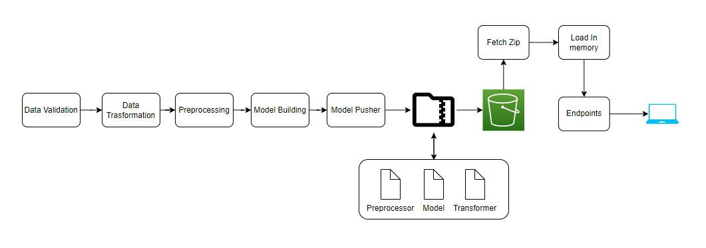

---

## Deployment Architecture

A typical deployment flow for this repository looks like:
1. **Training** is executed (locally/CI) to produce a validated model.
2. The approved model is **pushed** to a storage layer (commonly S3 or a registry).
3. A **prediction service** (batch job, API, or scheduled pipeline) loads the pushed model and runs inference on incoming data.

> Assumption (based on repo structure): model artifacts are stored locally and/or pushed to an S3 bucket using parameters defined in `sensor/constant/s3_bucket.py`.

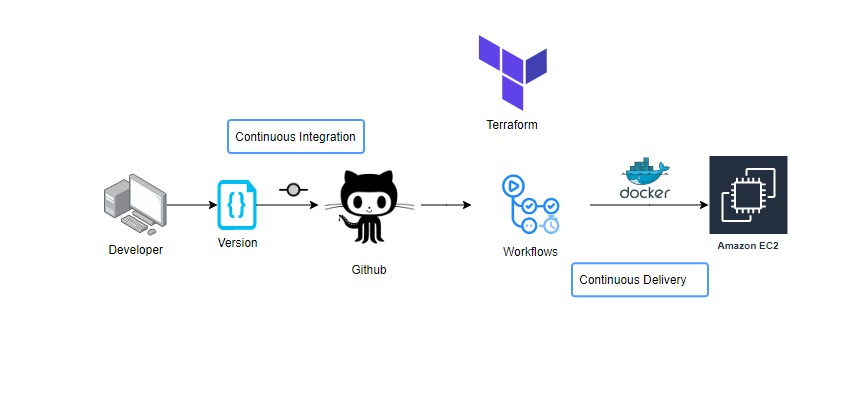

---

## Pipelines

### Training Pipeline

The training pipeline is a sequence of components that progressively turn raw sensor data into a validated, evaluated, and deployable model.

#### 1) Training Pipeline (Overall)

**Definition**
- The orchestrated workflow that runs all training components end-to-end and manages artifacts between steps.

**Inputs**
- Data source configuration (DB/S3/local depending on configuration)
- Schema definition: `config/schema.yaml`
- Pipeline configuration and environment variables

**Process / Steps**
1. Start pipeline run
2. Ingest raw data
3. Validate data (schema + quality checks)
4. Transform data (preprocessing/feature engineering)
5. Train a model
6. Evaluate against acceptance criteria / existing model
7. Push model to serving location (local registry/S3)

**Outputs / Artifacts**
- Ingestion artifacts (raw dataset snapshot)
- Validation reports
- Transformed datasets + preprocessing objects
- Trained model artifact
- Evaluation report
- Pushed model package (ready for inference)

**Where in code**
- Orchestration: `sensor/pipeline/training_pipeline.py`
- Entry point (typical): `main.py`

**Diagram**
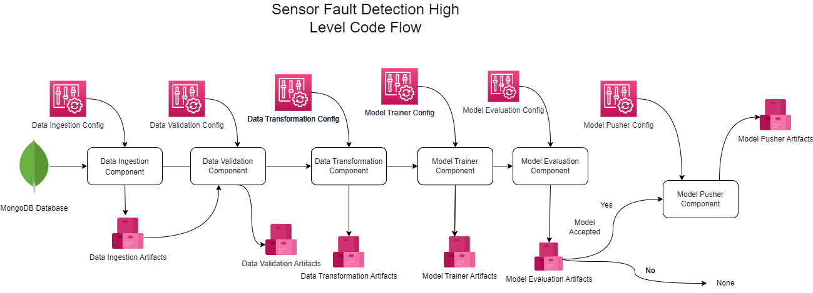

---

#### 2) Data Ingestion

**Definition**
- Collects raw sensor data from the configured source and writes it to an artifact location for downstream steps.

**Inputs**
- Data source settings (commonly MongoDB connection and collection details)
- Pipeline run configuration (artifact directories, file naming)

**Process / Steps**
1. Connect to data source
2. Read raw records (tabular sensor dataset)
3. Store raw dataset snapshot (e.g., CSV/Parquet) for reproducibility
4. Return ingestion artifact metadata (paths, counts)

**Outputs / Artifacts**
- Raw dataset file(s)
- Ingestion metadata (e.g., path references, record counts)

**Where in code**
- `sensor/components/data_ingestion.py`

**Diagram**
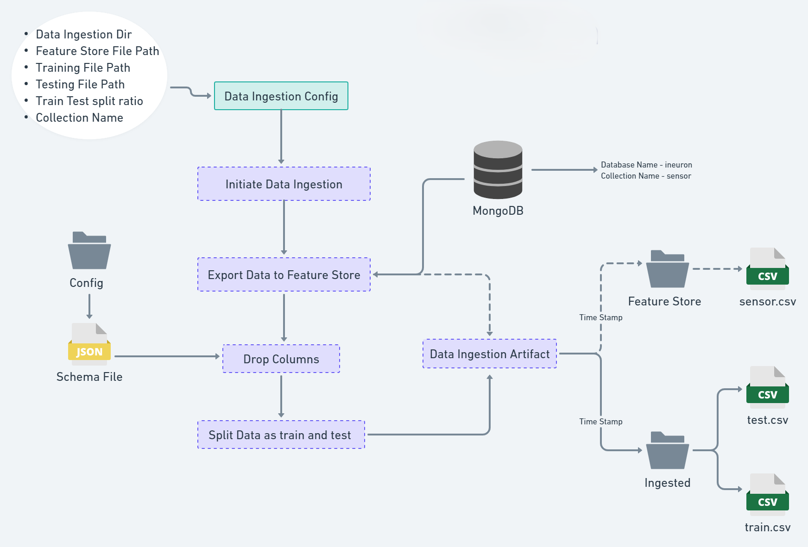

---

#### 3) Data Validation

**Definition**
- Ensures ingested data matches expected structure and basic quality rules before training.

**Inputs**
- Ingested raw dataset artifact
- Schema definition: `config/schema.yaml`

**Process / Steps**
1. Validate **columns** and expected feature set
2. Validate **data types** / basic constraints (as defined by schema)
3. Check dataset drift or statistical changes (typical in production pipelines)
4. Generate validation reports for traceability

**Outputs / Artifacts**
- Validation status (pass/fail)
- Validation report(s) (e.g., JSON/YAML/text)
- Drift report(s) (if implemented)

**Where in code**
- Component: `sensor/components/data_validation.py`
- Schema: `config/schema.yaml`

**Diagram**
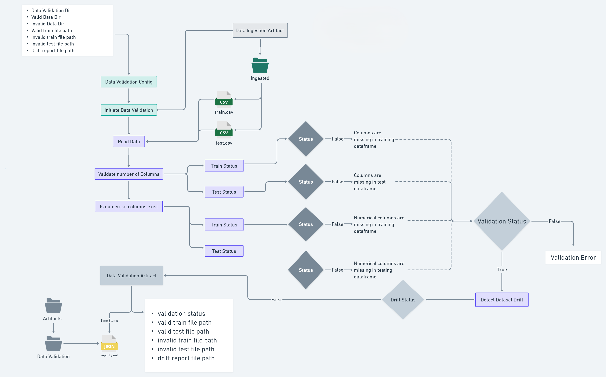

---

#### 4) Data Transformation

**Definition**
- Converts validated raw data into model-ready features using preprocessing steps.

**Inputs**
- Validated dataset artifact
- Transformation configuration (feature handling rules, target column info)

**Process / Steps**
1. Split features/target
2. Handle missing values (imputation strategies are common for sensor datasets)
3. Encode/scale features (as needed for the chosen model)
4. Save transformation pipeline/preprocessor object
5. Output transformed train/test datasets

**Outputs / Artifacts**
- Transformed training dataset
- Transformed test/validation dataset
- Saved preprocessing object (transformer/pipeline)

**Where in code**
- `sensor/components/data_transformation.py`

**Diagram**
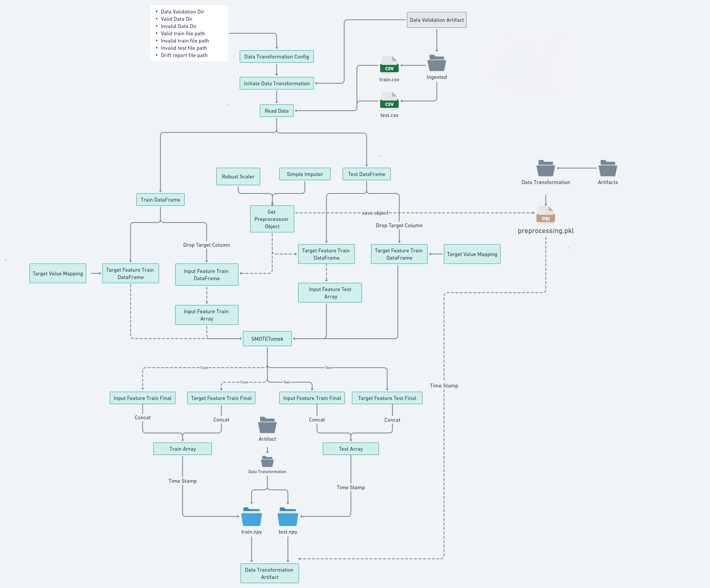

---

#### 5) Model Trainer

**Definition**
- Trains a classification model to predict APS-related failures from transformed sensor features.

**Inputs**
- Transformed datasets (train/test)
- Training configuration (algorithm parameters, scoring metric, thresholds)

**Process / Steps**
1. Load transformed training data
2. Train candidate model(s)
3. Compute training metrics (and optionally cross-validation metrics)
4. Persist the trained model artifact for evaluation

**Outputs / Artifacts**
- Trained model object/package
- Training metrics summary

**Where in code**
- `sensor/components/model_trainer.py`

**Diagram**
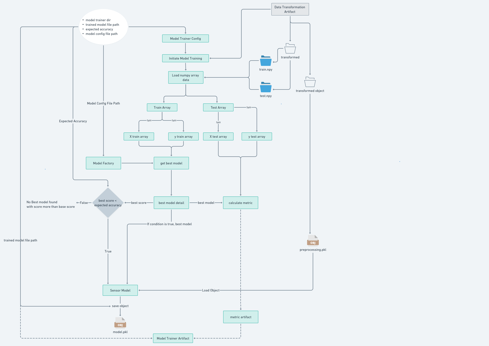

---

#### 6) Model Evaluation

**Definition**
- Compares the newly trained model against baseline criteria and/or a previously deployed model to decide if it should be promoted.

**Inputs**
- Newly trained model artifact
- Test dataset artifact
- (Optional) Existing “production” model artifact (for comparison)
- Evaluation criteria (metric thresholds, acceptance rules)

**Process / Steps**
1. Load candidate model and evaluation dataset
2. Compute evaluation metrics (e.g., precision/recall/F1/ROC-AUC; cost-aware metrics may be used)
3. Compare candidate vs. current model (if available)
4. Generate evaluation report and a promotion decision

**Outputs / Artifacts**
- Evaluation report (metrics + decision)
- Best-model selection decision (promote/reject)

**Where in code**
- `sensor/components/model_evaluation.py`

**Diagram**
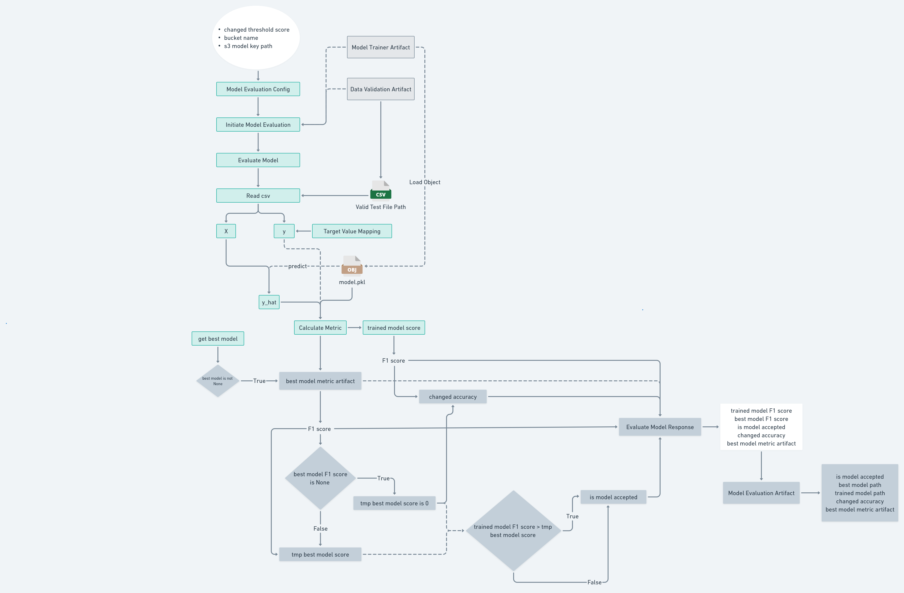

---

#### 7) Model Pusher

**Definition**
- Publishes the approved model to a target location for inference (local model registry and/or S3 bucket).

**Inputs**
- Approved model artifact
- Push destination configuration (paths, bucket settings, versioning)

**Process / Steps**
1. Validate that the model is approved for pushing
2. Copy/package the model to the “serving” directory or registry path
3. (Optional) Upload model artifacts to S3
4. Record pushed model metadata (version/path)

**Outputs / Artifacts**
- Pushed model package (servable)
- Push metadata (destination path, version)

**Where in code**
- `sensor/components/model_pusher.py`

**Diagram**
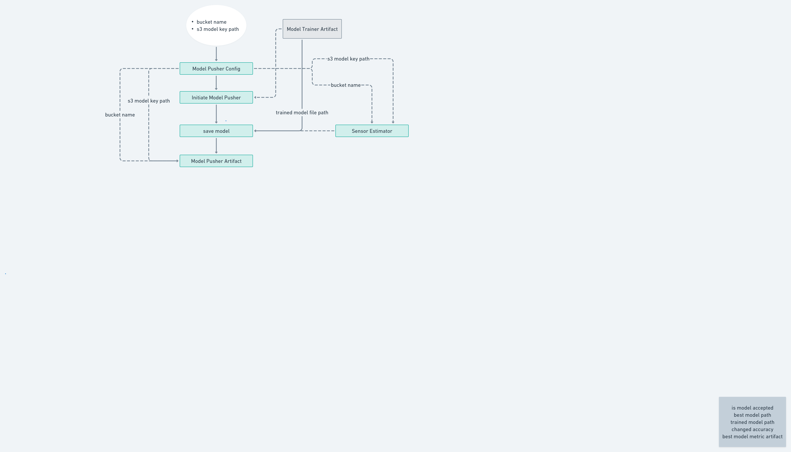

---

### Prediction Pipeline

**Definition**
- The inference workflow that loads the latest pushed model and generates predictions for new sensor data records.

**Inputs**
- Incoming sensor data (commonly a CSV file, dataframe, or API payload)
- Latest pushed model artifact (and preprocessing object)

**Steps**
1. Read input data
2. Load the pushed model + transformer/preprocessor
3. Apply the same transformations used during training
4. Generate predictions (class + optionally probability/score)
5. Return or save results

**Outputs**
- Predictions (e.g., `fault` vs `no_fault`, or class labels)
- Optional probability scores and a prediction report file

**Where prediction logic lives (by repo structure)**
- Entry point (typical): `main.py`
- Model utilities (typical): `sensor/ml/model/`
- Shared utilities: `sensor/utils/` and `sensor/utils/main_utils.py`

**Diagram**
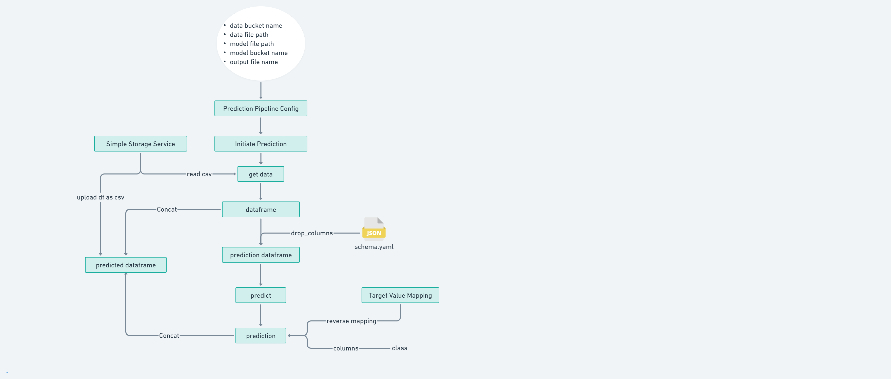

---

## Constants & Configuration

**What these constants/configs are used for**
- **Paths & artifact directories** (where ingestion/validation/transformation outputs are stored)
- **Database configuration** (MongoDB connectivity and collection settings)
- **Environment variables** (secrets/URLs/keys are typically injected via env vars)
- **Cloud bucket configuration** (S3 bucket names, prefixes, model registry paths)
- **Pipeline settings** (training pipeline naming, run IDs, default locations)

**Relevant modules**
- `sensor/constant/application.py`
- `sensor/constant/database.py`
- `sensor/constant/env_variable.py`
- `sensor/constant/s3_bucket.py`
- `sensor/constant/training_pipeline/`

**Diagram**
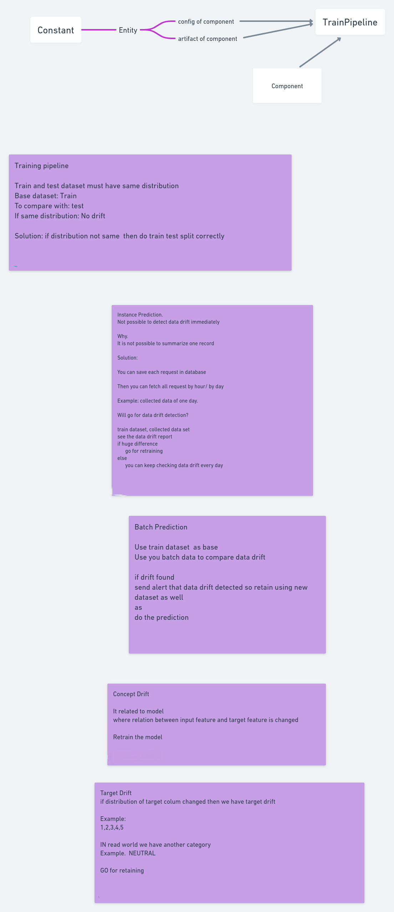

---

## How to Run

> Commands below reflect **typical usage** for a repository structured like this. Adjust if your `main.py` exposes different CLI arguments or modes.

### 1) Clone the repository
```bash
git clone <YOUR_REPO_URL>
cd Sensor-Fault-Detection
```

### 2) Create a virtual environment & install dependencies
```bash
python -m venv .venv
# Linux/Mac
source .venv/bin/activate
# Windows (PowerShell)
# .venv\Scripts\Activate.ps1

pip install -r requirements.txt
```

### 3) Set environment variables
This project includes modules for MongoDB and S3-style storage. Export environment variables as needed for your setup.

**Typical placeholders (do not hardcode secrets):**
- `MONGODB_URL` (or similar): MongoDB connection string
- `MONGODB_DATABASE_NAME`
- `MONGODB_COLLECTION_NAME`
- `AWS_ACCESS_KEY_ID`
- `AWS_SECRET_ACCESS_KEY`
- `AWS_DEFAULT_REGION`
- `S3_BUCKET_NAME` (or equivalent used by `sensor/constant/s3_bucket.py`)
- Any pipeline/runtime variables referenced in `sensor/constant/env_variable.py`

**Example (Linux/Mac):**
```bash
export MONGODB_URL="mongodb+srv://<user>:<password>@<cluster>/<db>"
export MONGODB_DATABASE_NAME="<database>"
export MONGODB_COLLECTION_NAME="<collection>"

export AWS_ACCESS_KEY_ID="<key>"
export AWS_SECRET_ACCESS_KEY="<secret>"
export AWS_DEFAULT_REGION="<region>"
export S3_BUCKET_NAME="<bucket>"
```

### 4) Run training
**Typical usage:**
```bash
python main.py
```

If your `main.py` supports modes (train/predict), it may look like:
```bash
python main.py train
```

### 5) Run prediction
**Typical usage (may vary by implementation):**
```bash
python main.py predict --input <path_to_input_csv> --output <path_to_predictions_csv>
```

### 6) Artifacts and logs
- **Artifacts** are typically written to a pipeline artifact directory (often under a project-level folder like `artifact/`, `artifacts/`, or a configured path).
- **Logs** are typically written according to `sensor/logger.py` configuration (console + file logging depending on setup).

> Assumption: artifact locations are controlled by constants in `sensor/constant/` and entities in `sensor/entity/`.

---

## Artifacts & Outputs

Below are typical artifacts produced by each pipeline stage (names/paths depend on your config/constants):

| Stage | Typical Artifacts Produced |
|---|---|
| Ingestion | Raw dataset snapshot (CSV/Parquet), ingestion metadata (record counts, file paths) |
| Validation | Validation status, schema check report, drift/quality report (if implemented) |
| Transformation | Transformed train/test arrays/files, saved preprocessing object (transformer/pipeline) |
| Training | Trained model artifact, training metrics summary |
| Evaluation | Evaluation report (metrics + promotion decision), comparison with existing model (if available) |
| Pusher | “Servable” model package in a registry directory and/or uploaded to S3, push metadata (version/path) |

---

## Repository Structure (Important Folders)

### Full repository tree
```text
Sensor-Fault-Detection/
├── .gitignore
├── .gitmodules
├── Flowcharts/
│   ├── 0_Sensor_Training_Pipeline.png
│   ├── 1_Sensor_Data_Ingestion_Component.png
│   ├── 2_Sensor_Data_Validation_Component .png
│   ├── 3_Sensor_Data_Transformation_Component.png
│   ├── 4_Sensor_Model_Trainer_Component.png
│   ├── 5_Sensor_Model_Evaluation_Component.png
│   ├── 6_Sensor_Model_Pusher_Component.png
│   ├── 7_Sensor_Prediction_Pipeline.png
│   ├── Constant.png
│   ├── Deployment_Archietecture.png
│   └── Project_Archietecture.png
├── LICENSE
├── Notebook/
│   ├── Scania_APS_failure_prediction.ipynb
│   └── aps_failure_training_set1.csv
├── README.md
├── Sensor.egg-info/
├── build/
├── config/
│   └── schema.yaml
├── dist/
├── main.py
├── requirements.txt
├── sensor/
│   ├── cloud_storage/
│   ├── components/
│   │   ├── data_ingestion.py
│   │   ├── data_transformation.py
│   │   ├── data_validation.py
│   │   ├── model_evaluation.py
│   │   ├── model_pusher.py
│   │   └── model_trainer.py
│   ├── config.py
│   ├── configuration/
│   │   └── mongo_db_connection.py
│   ├── constant/
│   │   ├── application.py
│   │   ├── database.py
│   │   ├── env_variable.py
│   │   ├── s3_bucket.py
│   │   └── training_pipeline/
│   ├── data_access/
│   │   └── sensor_data.py
│   ├── entity/
│   │   ├── artifact_entity.py
│   │   └── config_entity.py
│   ├── exception.py
│   ├── logger.py
│   ├── ml/
│   │   ├── metric/
│   │   └── model/
│   ├── pipeline/
│   │   └── training_pipeline.py
│   ├── utils.py
│   └── utils/
│       └── main_utils.py
└── setup.py
```

### What the key folders do
- **`sensor/components/`**
  - Individual pipeline steps (ingestion, validation, transformation, training, evaluation, pushing).
  - Each component typically reads an input artifact and produces an output artifact.

- **`sensor/pipeline/`**
  - Pipeline orchestration logic (end-to-end training workflow).

- **`sensor/entity/`**
  - Definitions of structured entities:
    - **Config entities** (what parameters a component needs)
    - **Artifact entities** (what a component produces for downstream steps)

- **`sensor/ml/`**
  - Model and metric utilities used during training/evaluation/prediction.

- **`config/`**
  - Central configuration files such as `schema.yaml` used by validation.

- **`Notebook/`**
  - Experimentation notebook and a sample dataset file for exploration/training reference.

- **`Flowcharts/`**
  - Visual documentation for architecture and each pipeline component.

---

## License

See [LICENSE](https://github.com/Shravan4598/Sensor-Fault-Detection/blob/main/LICENSE).
